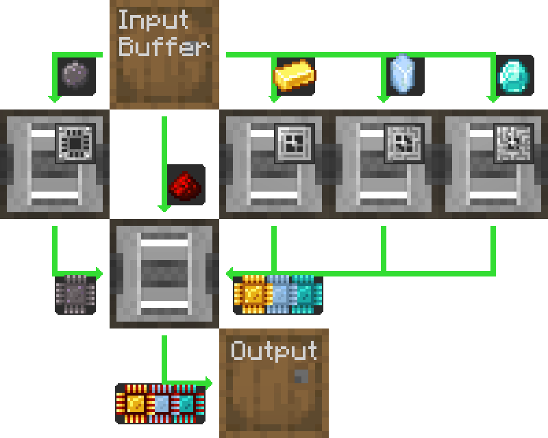
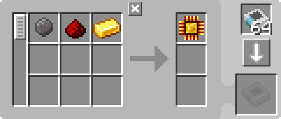
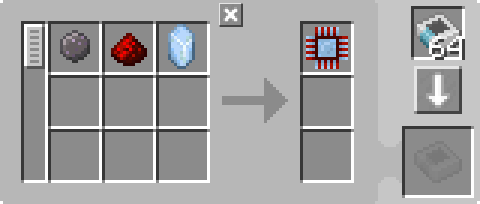
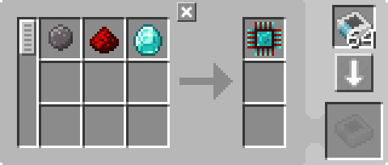
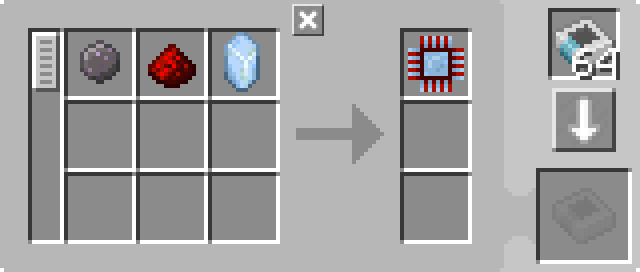

---
navigation:
  parent: example-setups/example-setups-index.md
  title: Автоматизация производства процессоров
  icon: inscriber
---

# Автоматизация производства процессоров

Существует множество способов автоматизации производства [процессоров](../items-blocks-machines/processors.md), и это один из них.

Эта общая схема может быть реализована с использованием любых логистических труб, каналов, проводов или других средств, которые предоставляет мод, при условии, что они поддерживают фильтрацию.

Здесь подробно описано, как реализовать это только с помощью AE2, используя [подсети "трубы"](pipe-subnet.md).

Обратите внимание, что поскольку в этой схеме используется <ItemLink id="pattern_provider" /> (МЭ поставщик шаблонов), она предназначена для интеграции в вашу систему [автоматического крафта](../ae2-mechanics/autocrafting.md).
Если вы хотите автоматизировать производство процессоров отдельно, замените поставщик шаблонов на ещё одну бочку и поместите ингредиенты непосредственно в верхнюю бочку.

Эта схема обратно совместима с предыдущими версиями AE2, поскольку даже если <ItemLink id="inscriber" /> (Вырезатели) имеют направленные стороны, подсети-трубы всё равно вставляют и извлекают из правильных сторон.

<GameScene zoom="4" interactive={true}>
  <ImportStructure src="../assets/assemblies/processor_automation.snbt" />

  <BoxAnnotation color="#dddddd" min="5 1 0" max="6 2 1" thickness=".05">
        (1) МЭ поставщик шаблонов: В стандартной конфигурации, с соответствующими шаблонами обработки.

        <Row>
            
            
            
        </Row>
  </BoxAnnotation>

  <BoxAnnotation color="#dddddd" min="4.7 2 0" max="5 3 1" thickness=".05">
        (2) Шина хранения #1: В стандартной конфигурации.
  </BoxAnnotation>

  <BoxAnnotation color="#dddddd" min="4 1 0" max="4.3 2 1" thickness=".05">
        (3) Шина экспорта #1: Отфильтрована на кремний, имеет 2 карты ускорения
        <Row><ItemImage id="silicon" scale="2" /> <ItemImage id="speed_card" scale="2" /></Row>
  </BoxAnnotation>

  <BoxAnnotation color="#dddddd" min="4 4 0" max="4.3 3 1" thickness=".05">
        (4) Шина экспорта #2: Отфильтрована на золотой слиток, имеет 2 карты ускорения
        <Row><ItemImage id="minecraft:gold_ingot" scale="2" /> <ItemImage id="speed_card" scale="2" /></Row>
  </BoxAnnotation>

  <BoxAnnotation color="#dddddd" min="4 5 0" max="4.3 4 1" thickness=".05">
        (5) Шина экспорта #3: Отфильтрована на кристалл истинного кварца, имеет 2 карты ускорения
        <Row><ItemImage id="certus_quartz_crystal" scale="2" /> <ItemImage id="speed_card" scale="2" /></Row>
  </BoxAnnotation>

  <BoxAnnotation color="#dddddd" min="4 6 0" max="4.3 5 1" thickness=".05">
        (6) Шина экспорта #4: Отфильтрована на алмаз, имеет 2 карты ускорения
        <Row><ItemImage id="minecraft:diamond" scale="2" /> <ItemImage id="speed_card" scale="2" /></Row>
  </BoxAnnotation>

  <BoxAnnotation color="#dddddd" min="2.3 3 0" max="2 2 1" thickness=".05">
        (7) Шина экспорта #5: Отфильтрована на красную пыль, имеет 2 карты ускорения
        <Row><ItemImage id="minecraft:redstone" scale="2" /> <ItemImage id="speed_card" scale="2" /></Row>
  </BoxAnnotation>

  <BoxAnnotation color="#dddddd" min="4 1 0" max="3 2 1" thickness=".05">
        (8) Вырезатель #1: В стандартной конфигурации. Имеет кремниевую печать и 4 карты ускорения
        <Row><ItemImage id="silicon_press" scale="2" /> <ItemImage id="speed_card" scale="2" /></Row>
  </BoxAnnotation>

  <BoxAnnotation color="#dddddd" min="4 3 0" max="3 4 1" thickness=".05">
        (9) Вырезатель #2: В стандартной конфигурации. Имеет логическую печать и 4 карты ускорения
        <Row><ItemImage id="logic_processor_press" scale="2" /> <ItemImage id="speed_card" scale="2" /></Row>
  </BoxAnnotation>

  <BoxAnnotation color="#dddddd" min="4 4 0" max="3 5 1" thickness=".05">
        (10) Вырезатель #3: В стандартной конфигурации. Имеет вычислительную печать и 4 карты ускорения
        <Row><ItemImage id="calculation_processor_press" scale="2" /> <ItemImage id="speed_card" scale="2" /></Row>
  </BoxAnnotation>

  <BoxAnnotation color="#dddddd" min="4 5 0" max="3 6 1" thickness=".05">
        (11) Вырезатель #4: В стандартной конфигурации. Имеет инженерную печать и 4 карты ускорения
        <Row><ItemImage id="engineering_processor_press" scale="2" /> <ItemImage id="speed_card" scale="2" /></Row>
  </BoxAnnotation>

  <BoxAnnotation color="#dddddd" min="2 2 0" max="1 3 1" thickness=".05">
        (12) Вырезатель #5: В стандартной конфигурации. Имеет 4 карты ускорения
        <ItemImage id="speed_card" scale="2" />
  </BoxAnnotation>

  <BoxAnnotation color="#dddddd" min="2.7 2 0" max="3 1 1" thickness=".05">
        (13) Шина импорта #1: В стандартной конфигурации, имеет 2 карты ускорения
        <ItemImage id="speed_card" scale="2" />
  </BoxAnnotation>

  <BoxAnnotation color="#dddddd" min="2.7 4 0" max="3 3 1" thickness=".05">
        (14) Шина импорта #2: В стандартной конфигурации, имеет 2 карты ускорения
        <ItemImage id="speed_card" scale="2" />
  </BoxAnnotation>

  <BoxAnnotation color="#dddddd" min="2.7 5 0" max="3 4 1" thickness=".05">
        (15) Шина импорта #3: В стандартной конфигурации, имеет 2 карты ускорения
        <ItemImage id="speed_card" scale="2" />
  </BoxAnnotation>

  <BoxAnnotation color="#dddddd" min="2.7 6 0" max="3 5 1" thickness=".05">
        (16) Шина импорта #4: В стандартной конфигурации, имеет 2 карты ускорения
        <ItemImage id="speed_card" scale="2" />
  </BoxAnnotation>

  <BoxAnnotation color="#dddddd" min="2 3 0" max="1 3.3 1" thickness=".05">
        (17) Шина хранения #2: В стандартной конфигурации.
  </BoxAnnotation>

  <BoxAnnotation color="#dddddd" min="2 1.7 0" max="1 2 1" thickness=".05">
        (18) Шина хранения #3: В стандартной конфигурации.
  </BoxAnnotation>

  <BoxAnnotation color="#dddddd" min="1 2 0" max="0.7 3 1" thickness=".05">
        (19) Шина импорта #5: В стандартной конфигурации, имеет 2 карты ускорения
        <ItemImage id="speed_card" scale="2" />
  </BoxAnnotation>

  <BoxAnnotation color="#dddddd" min="5 0.7 0" max="6 1 1" thickness=".05">
        (20) Шина хранения #4: В стандартной конфигурации.
  </BoxAnnotation>

<BoxAnnotation color="#dddddd" min="3.3 2.7 0.3" max="3.7 3 0.7" thickness=".05">
        Кварцевое волокно питает все три вырезателя, поскольку вырезатели действуют как кабели и передают энергию
  </BoxAnnotation>

<DiamondAnnotation pos="7 1.5 0.5" color="#00ff00">
        К основной сети
    </DiamondAnnotation>

  <IsometricCamera yaw="185" pitch="5" />
</GameScene>

## Конфигурации

* <ItemLink id="pattern_provider" /> (МЭ поставщик шаблонов) (1) находится в стандартной конфигурации с соответствующими <ItemLink id="processing_pattern" /> (Шаблонами обработки).

  
  
  

* <ItemLink id="storage_bus" /> (Шины хранения) (2, 17, 18, 20) находятся в стандартной конфигурации.
* <ItemLink id="export_bus" /> (Шины экспорта) (3-7) отфильтрованы на соответствующий ингредиент. Каждая имеет 2 <ItemLink id="speed_card" /> (Карты ускорения).
    <Row>
      <ItemImage id="silicon" scale="2" />
      <ItemImage id="minecraft:gold_ingot" scale="2" />
      <ItemImage id="certus_quartz_crystal" scale="2" />
      <ItemImage id="minecraft:diamond" scale="2" />
      <ItemImage id="minecraft:redstone" scale="2" />
    </Row>
* <ItemLink id="import_bus" /> (Шины импорта) (13-16, 19) находятся в стандартной конфигурации. Каждая имеет 2 <ItemLink id="speed_card" /> (Карты ускорения).
* <ItemLink id="inscriber" /> (Вырезатели) находятся в стандартной конфигурации. Каждый имеет соответствующую [печать](../items-blocks-machines/presses.md)
   и 4 <ItemLink id="speed_card" /> (Карты ускорения).
   <Row>
     <ItemImage id="silicon_press" scale="2" />
     <ItemImage id="logic_processor_press" scale="2" />
     <ItemImage id="calculation_processor_press" scale="2" />
     <ItemImage id="engineering_processor_press" scale="2" />
   </Row>

## Как это работает

1. <ItemLink id="pattern_provider" /> (МЭ поставщик шаблонов) отправляет ингредиенты в бочку.
2. Первая [подсеть-труба](pipe-subnet.md) (оранжевая) извлекает кремний, красную пыль и ингредиент соответствующего процессора
   (золотой слиток, кристалл истинного кварца или алмаз) из бочки и помещает их в соответствующий <ItemLink id="inscriber" /> (Вырезатель).
3. Первые четыре <ItemLink id="inscriber" /> (Вырезателя) создают <ItemLink id="printed_silicon" /> (Печатный кремний), а также <ItemLink id="printed_logic_processor" /> (Печатную логическую схему),
   <ItemLink id="printed_calculation_processor" /> (Печатную вычислительную схему) или <ItemLink id="printed_engineering_processor" /> (Печатную инженерную схему).
4. Вторая и третья [подсети-трубы](pipe-subnet.md) (зелёные) извлекают печатные схемы из первых четырёх <ItemLink id="inscriber" /> (Вырезателей)
   и помещают их в пятый, финальный <ItemLink id="inscriber" /> (Вырезатель).
5. Пятый <ItemLink id="inscriber" /> (Вырезатель) собирает [процессор](../items-blocks-machines/processors.md).
6. Четвёртая [подсеть-труба](pipe-subnet.md) (фиолетовая) помещает процессор в поставщик шаблонов, возвращая его в основную сеть.