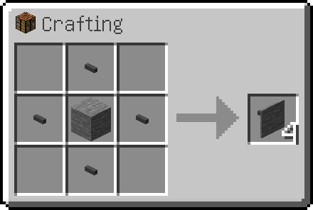

---
navigation:
  parent: items-blocks-machines-index.md
  title: МЭ фасады
  icon: facade
  icon_nbt: '{item: "minecraft:stone"}'
  position: 110
categories:
- network infrastructure
item_ids:
- ae2:facade
---

# МЭ фасады

МЭ фасады можно использовать, чтобы сделать вашу базу более аккуратной. Они могут покрывать кабели обоих размеров и изготавливаться из множества видов блоков.

<GameScene zoom="6" background="transparent">
  <ImportStructure src="../assets/assemblies/facades_1.snbt" />
  <IsometricCamera yaw="195" pitch="30" />
</GameScene>

Они могут покрывать все стороны кабеля, но позволяют [субкомпонентам](../ae2-mechanics/cable-subparts.md) и соединениям кабелей выступать наружу.

<GameScene zoom="6" interactive={true}>
  <ImportStructure src="../assets/assemblies/facades_2.snbt" />
  <IsometricCamera yaw="195" pitch="30" />
</GameScene>

Проявите изобретательность, чтобы улучшить эстетику базы или создать блоки с разными текстурами на каждой стороне.

<GameScene zoom="4" interactive={true}>
  <ImportStructure src="../assets/assemblies/facades_3.snbt" />
  <IsometricCamera yaw="195" pitch="30" />
</GameScene>

## Скрытие фасадов

МЭ фасады скрываются, если держать в любой руке <a href="network_tool.md">МЭ сетевой инструмент</a>.

Вы можете взаимодействовать с блоками за скрытыми фасадами, не удаляя их.

## Рецепт

Поместите блок с нужной текстурой в центр, окружив его 4 <ItemLink id="cable_anchor" />.

