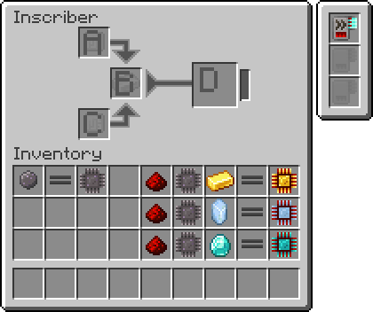
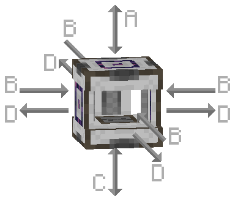

---
navigation:
  parent: items-blocks-machines-index.md
  title: МЭ инскрайбер
  icon: inscriber
  position: 310
categories:
- machines
item_ids:
- ae2:inscriber
---

# МЭ инскрайбер

<BlockImage id="inscriber" scale="8" />

МЭ инскрайбер используется для создания схем и [процессоров](processors.md) с помощью [клише](presses.md), а также для измельчения различных предметов в пыль. Он может принимать как энергию AE2 (AE), так и энергию Fabric/Forge (E/FE). Его можно настроить на разделение сторон, так что вставка предметов с разных сторон помещает их в разные слоты инвентаря. Для этого его можно поворачивать с помощью <ItemLink id="certus_quartz_wrench" />. Также он может быть настроен на выталкивание результатов крафта в соседние инвентари.

Размер входного буфера можно регулировать. Например, если вы хотите подавать предметы из одного инвентаря в большой массив инскрайберов, лучше использовать маленький буфер, чтобы материалы распределялись между инскрайберами более оптимально (вместо того, чтобы первый инскрайбер заполнялся до 64, а остальные оставались пустыми).

Четыре клише для схем используются для создания [процессоров](processors.md):

<Row>
  <ItemImage id="silicon_press" scale="4" />
  <ItemImage id="logic_processor_press" scale="4" />
  <ItemImage id="calculation_processor_press" scale="4" />
  <ItemImage id="engineering_processor_press" scale="4" />
</Row>

Клише с названием можно использовать для именования блоков, подобно наковальне, что полезно для маркировки в <ItemLink id="pattern_access_terminal" />.

<ItemImage id="name_press" scale="4" />

## Настройки

* МЭ инскрайбер можно настроить на разделение сторон (как описано ниже) или разрешить ввод в любой слот с любой стороны, с внутренним фильтром, определяющим, что куда идёт. В неразделённом режиме предметы нельзя извлечь из верхнего и нижнего слотов.
* МЭ инскрайбер можно настроить на выталкивание предметов в соседние инвентари.
* Размер входного буфера можно регулировать: большой подходит для одиночного инскрайбера, который вы загружаете вручную, маленький — для больших параллельных установок.

## Интерфейс и разделение сторон

В режиме разделения сторон МЭ инскрайбер фильтрует, что и куда идёт, в зависимости от стороны, с которой вы вставляете или извлекаете предметы.

 

A. **Верхний вход** доступен через верхнюю сторону инскрайбера (предметы можно вставлять и извлекать из этого слота).

B. **Центральный вход** доступен через левую, правую, переднюю и заднюю стороны инскрайбера (предметы можно только вставлять в этот слот, извлечение невозможно).

C. **Нижний вход** доступен через нижнюю сторону инскрайбера (предметы можно вставлять и извлекать из этого слота).

D. **Выход** доступен через левую, правую, переднюю и заднюю стороны инскрайбера (предметы можно только извлекать из этого слота, вставка невозможна).

## Простая автоматизация

Например, разделение сторон и возможность поворота позволяют полуавтоматизировать инскрайберы следующим образом:

<GameScene zoom="4" background="transparent">
  <ImportStructure src="../assets/assemblies/inscriber_hopper_automation.snbt" />
  <IsometricCamera yaw="195" pitch="30" />
</GameScene>

Или просто подавайте и извлекайте предметы из инскрайбера в неразделённом режиме.

## Улучшения

МЭ инскрайбер поддерживает следующие [улучшения](upgrade_cards.md):

* <ItemLink id="speed_card" />

## Рецепт

<RecipeFor id="inscriber" />
