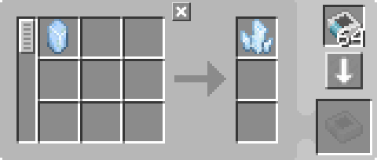

---
navigation:
  parent: example-setups/example-setups-index.md
  title: Автоматизация зарядника
  icon: charger
---

# Автоматизация зарядника

Обратите внимание, что поскольку эта установка использует <ItemLink id="pattern_provider" /> (МЭ поставщик шаблонов), она предназначена для интеграции в вашу систему [автоизготовления](../ae2-mechanics/autocrafting.md). Если вы хотите автоматизировать <ItemLink id="charger" /> (Зарядник) отдельно, используйте воронки, сундуки и тому подобное.

Автоматизация <ItemLink id="charger" /> (Зарядника) довольно проста. <ItemLink id="pattern_provider" /> (МЭ поставщик шаблонов) передаёт ингредиенты в зарядник, затем [подсеть труб](pipe-subnet.md) или другая система транспортировки предметов возвращает результат обратно в поставщик.

<GameScene zoom="6" interactive={true}>
  <ImportStructure src="../assets/assemblies/charger_automation.snbt" />

<BoxAnnotation color="#dddddd" min="1 0 0" max="2 1 1">
        (1) МЭ поставщик шаблонов: В стандартной конфигурации, с соответствующими шаблонами обработки. Также обеспечивает зарядник [энергией](../ae2-mechanics/energy.md).

        
  </BoxAnnotation>

<BoxAnnotation color="#dddddd" min="0 1 0" max="1 1.3 1">
        (2) МЭ шина импорта: В стандартной конфигурации.
  </BoxAnnotation>

<BoxAnnotation color="#dddddd" min="1 1 0" max="2 1.3 1">
        (3) МЭ шина хранения: В стандартной конфигурации.
  </BoxAnnotation>

<DiamondAnnotation pos="4 0.5 0.5" color="#00ff00">
        К основной сети
    </DiamondAnnotation>

  <IsometricCamera yaw="195" pitch="30" />
</GameScene>

## Настройки

* <ItemLink id="pattern_provider" /> (МЭ поставщик шаблонов) (1) находится в стандартной конфигурации с соответствующими <ItemLink id="processing_pattern" /> (Шаблонами обработки). Он также обеспечивает <ItemLink id="charger" /> (Зарядник) [энергией](../ae2-mechanics/energy.md), так как действует как [кабель](../items-blocks-machines/cables.md).
  
    

* <ItemLink id="import_bus" /> (МЭ шина импорта) (2) находится в стандартной конфигурации.
* <ItemLink id="storage_bus" /> (МЭ шина хранения) (3) находится в стандартной конфигурации.

## Как это работает

1. <ItemLink id="pattern_provider" /> (МЭ поставщик шаблонов) передаёт ингредиенты в <ItemLink id="charger" /> (Зарядник).
2. Зарядник выполняет процесс зарядки.
3. <ItemLink id="import_bus" /> (МЭ шина импорта) на зелёной подсети извлекает результат из зарядника и пытается сохранить его в [сетевое хранилище](../ae2-mechanics/import-export-storage.md).
4. Единственное хранилище в зелёной подсети — <ItemLink id="storage_bus" /> (МЭ шина хранения), которая сохраняет полученные предметы в поставщике шаблонов, возвращая их в основную сеть.