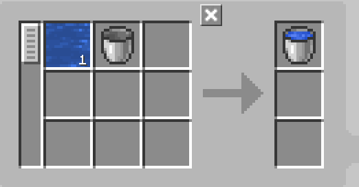
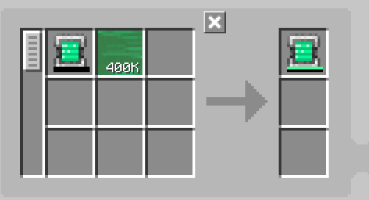

---
navigation:
    parent: epp_intro/epp_intro-index.md
    title: МЭ Наполнитель
    icon: extendedae:caner
categories:
- extended devices
item_ids:
- extendedae:caner
---

# МЭ Наполнитель

<BlockImage id="extendedae:caner" scale="8"></BlockImage>

МЭ Наполнитель — это устройство, которое "упаковывает" различные вещества, включая жидкости, газы Mekanism, ману Botania и даже энергию!

Первый слот предназначен для вещества, которым нужно наполнить, а второй слот — для контейнера, который будет наполнен.

Для работы требуется энергия, и каждая операция потребляет 80 АЕ.

По умолчанию устройство работает только с жидкостями. Для наполнения другими веществами необходимо установить соответствующие дополнения.

### Поддерживаемые дополнения:
- Applied Flux
- Applied Mekanistics
- Applied Botanics Addon

## Автоматическое создание с МЭ Наполнителем

Энергия и подключение к сети возможны только через верхнюю и нижнюю стороны устройства.

<GameScene zoom="6" background="transparent">
  <ImportStructure src="../structure/caner_example.snbt"></ImportStructure>
</GameScene>

Простая установка для МЭ Наполнителя. МЭ Наполнитель автоматически выбрасывает наполненный предмет, когда получает ингредиенты от <ItemLink id="ae2:pattern_provider" />.

<GameScene zoom="6" background="transparent">
  <ImportStructure src="../structure/caner_auto.snbt"></ImportStructure>
</GameScene>

Шаблон должен содержать только вещество для наполнения и контейнер для наполнения. Примеры:

Наполнение ведра водой:

Зарядка энергетической таблетки (требуется установленное дополнение Applied Flux):

## Опустошение

МЭ Наполнитель также может опустошать контейнеры в режиме опустошения. Для этого необходимо поменять местами входы и выходы в шаблоне.