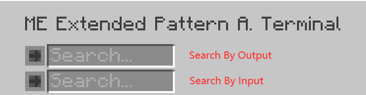
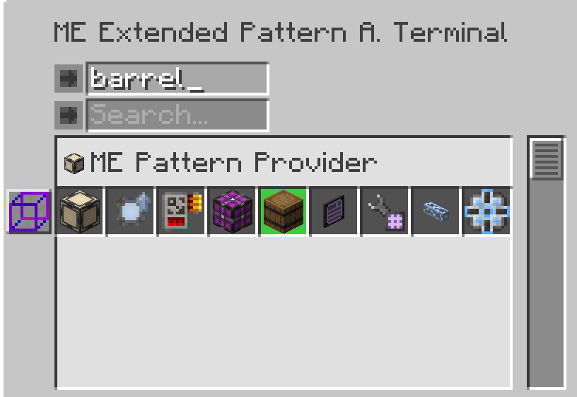
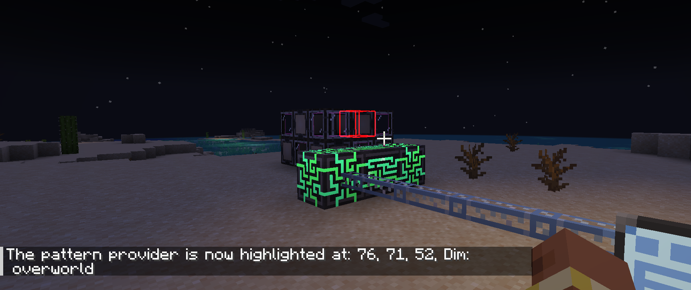

---
navigation:
    parent: epp_intro/epp_intro-index.md
    title: МЭ Расширенный терминал доступа к шаблонам
    icon: extendedae:ex_pattern_access_part
categories:
- extended devices
item_ids:
- extendedae:ex_pattern_access_part
- extendedae:wireless_ex_pat
---

# МЭ Расширенный терминал доступа к шаблонам

МЭ Расширенный терминал доступа к шаблонам предоставляет 3 дополнительные функции по сравнению с <ItemLink id="ae2:pattern_access_terminal" />.

<Row gap="20">
<GameScene zoom="6" background="transparent">
<ImportStructure src="../structure/cable_ex_pattern_terminal.snbt"></ImportStructure>
<IsometricCamera yaw="180"></IsometricCamera>
</GameScene>
<ItemImage id="extendedae:wireless_ex_pat" scale="4"></ItemImage>
</Row>

## Улучшенный поиск шаблонов

Вы можете искать шаблоны по названию входных или выходных ингредиентов.

## Подсветка шаблонов

Иногда сложно найти нужный шаблон, так как они отображаются группами. МЭ Расширенный терминал доступа к шаблонам может подсвечивать подходящий шаблон в интерфейсе.

## Подсветка поставщика шаблонов в мире

Бывает сложно определить, какой поставщик шаблонов застопорился при выполнении больших задач крафта. МЭ Расширенный терминал доступа к шаблонам может подсвечивать поставщик шаблонов в мире, что упрощает его поиск.

