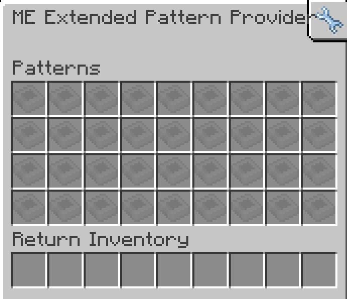

---
navigation:
    parent: epp_intro/epp_intro-index.md
    title: МЭ Расширенный поставщик шаблонов
    icon: extendedae:ex_pattern_provider
categories:
- extended devices
item_ids:
- extendedae:ex_pattern_provider
- extendedae:ex_pattern_provider_part
---

# МЭ Расширенный поставщик шаблонов

<Row gap="20">
<BlockImage id="extendedae:ex_pattern_provider" scale="8"></BlockImage>
<BlockImage id="extendedae:ex_pattern_provider" p:push_direction="up" scale="8"></BlockImage>
<GameScene zoom="8" background="transparent">
  <ImportStructure src="../structure/cable_ex_pattern_provider.snbt"></ImportStructure>
</GameScene>
</Row>

МЭ Расширенный поставщик шаблонов — это <ItemLink id="ae2:pattern_provider" /> с увеличенным инвентарём для шаблонов.

*Кому нужна подсеть, если можно разместить все шаблоны в одном блоке?*

