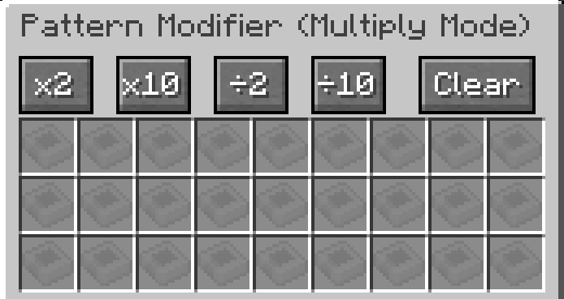
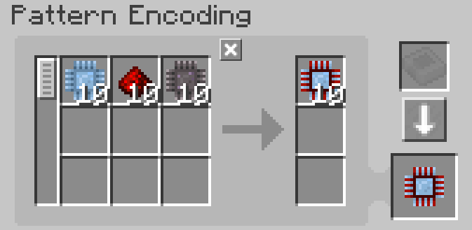
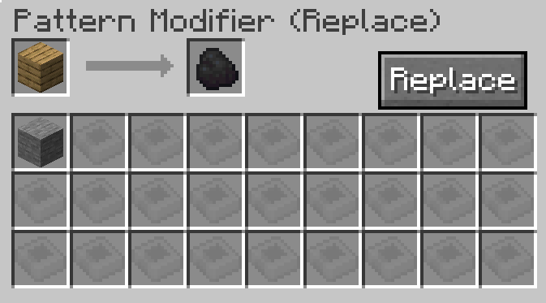

---
navigation:
    parent: epp_intro/epp_intro-index.md
    title: Модификатор шаблонов
    icon: extendedae:pattern_modifier
categories:
- extended items
item_ids:
- extendedae:pattern_modifier
---

# Модификатор шаблонов

Модификатор шаблонов — это инструмент для массового изменения шаблонов.

<ItemImage id="extendedae:pattern_modifier" scale="4"></ItemImage>

Щёлкните правой кнопкой мыши, чтобы открыть его интерфейс.

## Режим умножения

Вы можете умножить или разделить количество входных и выходных материалов в шаблоне обработки, нажав соответствующую кнопку.

Исходный шаблон:

После умножения на 10:

Также можно очистить содержимое всех шаблонов, превратив их в пустые, нажав кнопку "Очистка".

### Примечания:

- Кнопка деления работает только если количество делится нацело. Например, кнопка ÷2 не сработает, если шаблон требует 3 булыжника, так как 3 ÷ 2 = 1.5.

- Кнопка умножения имеет ограничение (999999). Нельзя увеличить количество одного ингредиента выше этого значения.

## Режим замены

Заменяет определённый входной или выходной ингредиент шаблона обработки на другой предмет.

Слот A — это то, что будет заменено, а слот B — то, на что будет произведена замена.

Например, следующая настройка заменит доски на уголь.

Нажмите кнопку "Замена", чтобы выполнить замену.

## Режим клонирования

В этом режиме вы можете скопировать любой заданный шаблон.

