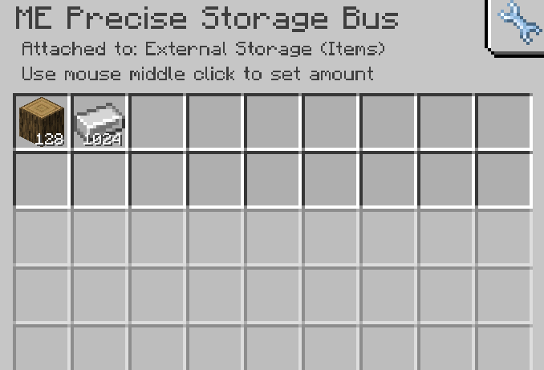

---
navigation:
    parent: epp_intro/epp_intro-index.md
    title: МЭ Точная шина хранения
    icon: extendedae:precise_storage_bus
categories:
- extended devices
item_ids:
- extendedae:precise_storage_bus
---

# МЭ Точная шина хранения

<GameScene zoom="8" background="transparent">
  <ImportStructure src="../structure/cable_precise_storage_bus.snbt"></ImportStructure>
</GameScene>

МЭ Точная шина хранения — это <ItemLink id="ae2:storage_bus" />, которую можно настроить с указанием числового лимита, и она будет добавлять предметы только до этого предела.

