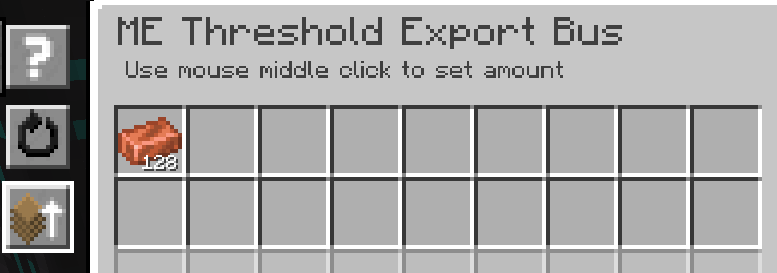
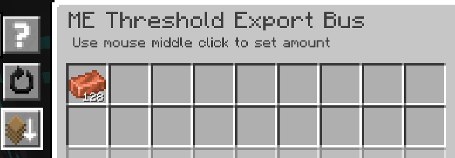

---
navigation:
    parent: epp_intro/epp_intro-index.md
    title: МЭ Пороговая шина экспорта
    icon: extendedae:threshold_export_bus
categories:
- extended devices
item_ids:
- extendedae:threshold_export_bus
---

# МЭ Пороговая шина экспорта

<GameScene zoom="8" background="transparent">
  <ImportStructure src="../structure/cable_threshold_export_bus.snbt"></ImportStructure>
</GameScene>

МЭ Пороговая шина экспорта работает, когда количество предмета в сети МЭ выше или ниже установленного порога.

## Пример

Порог для меди установлен на 128, поэтому шина экспортирует медь, если её количество в сети превышает 128.

Порог тот же, но режим установлен на "МЕНЬШЕ". Шина экспортирует медь, если её количество в сети ниже 128.