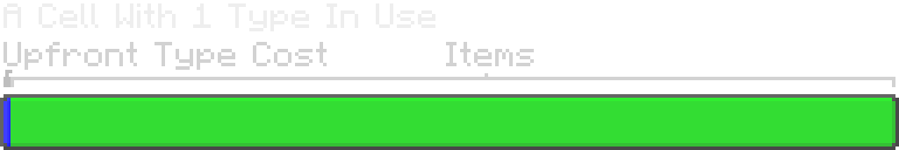
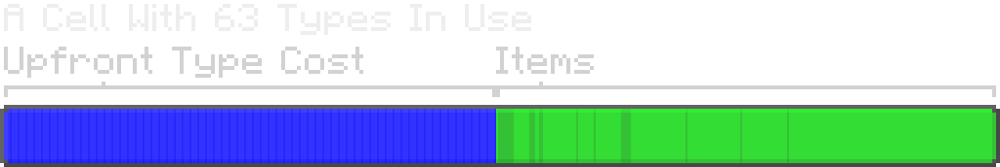

---
navigation:
  parent: ae2-mechanics/ae2-mechanics-index.md
  title: Байты и типы
  icon: creative_item_cell
---

# Байты и типы

<Row>
    <ItemImage id="item_storage_cell_1k" scale="4" />
    <ItemImage id="item_storage_cell_4k" scale="4" />
    <ItemImage id="item_storage_cell_16k" scale="4" />
    <ItemImage id="item_storage_cell_64k" scale="4" />
    <ItemImage id="item_storage_cell_256k" scale="4" />
</Row>

[МЭ камеры хранения](../items-blocks-machines/storage_cells.md) определяются *байтами* и *типами*. Байты, как в реальном компьютере, измеряют общее количество "вещей" в ячейке хранения. Типы измеряют, сколько различных, ну, *типов* вещей хранится в ячейке. Каждый тип представляет уникальный предмет, так что 4,096 булыжников — это 1 тип, но 16 разных мечей с разными зачарованиями — это 16 типов.

Каждая ячейка хранения может содержать фиксированное количество данных. Каждый тип заранее потребляет некоторое количество байтов (зависит от размера ячейки), а каждый предмет потребляет один бит хранилища, так что восемь предметов потребляют один байт, а полный стак из 64 предметов — 8 байтов, независимо от того, как предметы стакаются вне МЭ-сети. Например, 64 одинаковых сёдел не занимают больше места, чем 64 камня.

Ещё раз: каждый предмет — это 1 бит, так что 8 предметов равны 1 байту. Для жидкостных ячеек это 8 вёдер на байт.

Многие жалуются на ограниченное количество типов, которое может содержать ячейка, но это ***необходимое ограничение***. Ячейки хранят свои данные в NBT-теге самого предмета, что делает их довольно стабильными. Однако слишком большое количество данных в ячейке может привести к отправке слишком большого объёма данных игроку, вызывая эффект, схожий с "баном книги" в ванильном Minecraft. Кроме того, слишком много разных типов в системе увеличивает нагрузку на сортировку и обработку предметов. Однако это ограничение не так уж сильно ограничивает. Один отсек <ItemLink id="drive" />, полный ячеек, — это 630 типов, что на самом деле довольно много, если не хранить кучу уникальных нестакающихся предметов.

По этой причине типы существуют, чтобы "настоятельно отговаривать" вас сбрасывать сотни случайно повреждённых доспехов и инструментов из ферм мобов прямо в вашу МЭ-систему. Каждая часть доспехов с уникальным уроном и зачарованиями должна храниться как отдельная запись, вызывая перегрузку. Рекомендуется отфильтровывать их из потока предметов до того, как они попадут в систему.

Стремление сразу к ячейкам хранения высшего уровня — не всегда лучшая идея, поскольку вы тратите больше ресурсов, но не получаете дополнительного пространства для типов. Это означает, что ячейки всех размеров остаются полезными даже на поздних этапах игры, так как у них есть свои компромиссы.

Ниже приведена таблица, сравнивающая различные уровни ячеек хранения, их вместимость и примерную стоимость.

## Содержимое ячеек хранения против стоимости

| Ячейка                                     | Байты   | Типы | Байты на тип | Истинный кварц | Редстоун | Золото | Светопыль |
|-------------------------------------------|--------:|-----:|------------:|--------------:|---------:|-------:|----------:|
| <ItemLink id="item_storage_cell_1k" />    |  1,024  |  63  |          8  |            4  |       5 |     1 |        0  |
| <ItemLink id="item_storage_cell_4k" />    |  4,096  |  63  |         32  |        14.25  |      20 |     3 |        0  |
| <ItemLink id="item_storage_cell_16k" />   | 16,384  |  63  |        128  |           45  |      61 |     9 |        4  |
| <ItemLink id="item_storage_cell_64k" />   | 65,536  |  63  |        512  |       137.25  |     184 |    27 |       16  |
| <ItemLink id="item_storage_cell_256k" />  | 262,144 |  63  |       2048  |          414  |     553 |    81 |       48  |

## Вместимость хранения при различном количестве типов

Затраты на типы таковы, что ячейка с одним типом может содержать в 2 раза больше, чем ячейка, использующая все 63 типа.

| Ячейка                                     | Общая вместимость ячейки с 1 типом | Общая вместимость ячей с 63 типами |
|-------------------------------------------|-------------------------------------:|:|
| <ItemLink id="item_storage_cell_1k" />    |                               8,128 | 4,160 |
| <ItemLink id="item_storage_cell_4k" />    |                              28,672 |                              14,976 |
| <ItemLink id="item_storage_cell_16k" />   |                             130,048 |                              66,560 |
| <ItemLink id="item_storage_cell_64k" />   |                             520,192 |                             266,240 |
| <ItemLink id="item_storage_cell_256k" />  |                           2,080,768 |                           1,064,960 |

