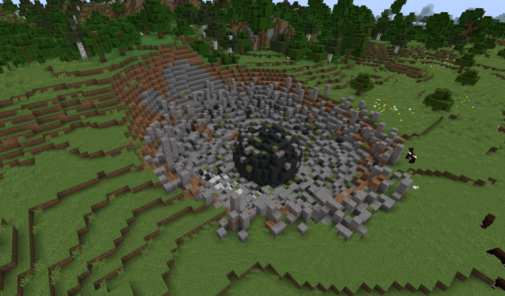

---
navigation:
  parent: ae2-mechanics/ae2-mechanics-index.md
  title: Метеориты
  icon: sky_stone_block
---

# Метеориты

<GameScene zoom="4" background="transparent">
  <ImportStructure src="../assets/assemblies/meteor_interior.snbt" />
</GameScene>

Метеориты — это отправная точка для использования AE2. Они предоставляют ключевые материалы: [цветущие блоки истинного кварца](../items-blocks-machines/budding_certus.md) различных типов и <ItemLink id="mysterious_cube" /> в центре.

[Начало работы](../getting-started.md) предоставит информацию о том, что делать после нахождения метеорита.

## Поиск метеоритов

Метеориты встречаются довольно часто и оставляют огромные кратеры в земле, так что, возможно, вы уже нашли несколько. Если нет, <ItemLink id="meteorite_compass" /> укажет на ближайший таинственный куб.

