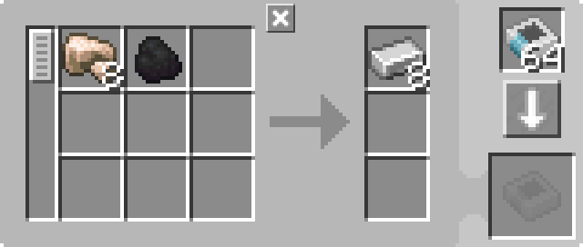

---
navigation:
  parent: example-setups/example-setups-index.md
  title: Автоматизация печи
  icon: minecraft:furnace
---

# Автоматизация печи

Обратите внимание, что поскольку эта установка использует <ItemLink id="pattern_provider" /> (МЭ поставщик шаблонов), она предназначена для интеграции в вашу систему [автоизготовления](../ae2-mechanics/autocrafting.md). Если вы хотите автоматизировать печь отдельно, используйте воронки, сундуки и тому подобное.

Автоматизация <ItemLink id="minecraft:furnace" /> (Печи) немного сложнее, чем автоматизация более простых машин, таких как [зарядник](../example-setups/charger-automation.md). Печь требует ввода с двух разных сторон и извлечения с третьей. Предмет для плавки должен быть помещён в верхнюю грань, топливо — в боковую грань, а результат должен быть извлечён из нижней грани.

Это можно сделать с помощью <ItemLink id="pattern_provider" /> (МЭ поставщика шаблонов) сверху, <ItemLink id="export_bus" /> (МЭ шины экспорта) сбоку для постоянной подачи топлива и <ItemLink id="import_bus" /> (МЭ шины импорта) снизу для импорта результатов в сеть. Однако это требует 3 [каналов](../ae2-mechanics/channels.md).

Вот как это можно сделать, используя только 1 канал:

<GameScene zoom="6" interactive={true}>
  <ImportStructure src="../assets/assemblies/furnace_automation.snbt" />

<BoxAnnotation color="#dddddd" min="1 0 0" max="2 1 1">
        (1) МЭ поставщик шаблонов: Направленный вариант, настроенный с помощью <ItemLink id="certus_quartz_wrench" /> (Гаечного ключа из истинного кварца), с соответствующими шаблонами обработки.

        
  </BoxAnnotation>

<BoxAnnotation color="#dddddd" min="1 1 0" max="2 1.3 1">
        (2) МЭ-интерфейс: В стандартной конфигурации.
  </BoxAnnotation>

<BoxAnnotation color="#dddddd" min="1 1 0" max="1.3 2 1">
        (3) МЭ шина хранения №1: Отфильтрована на уголь.
        <ItemImage id="minecraft:coal" scale="2" />
  </BoxAnnotation>

<BoxAnnotation color="#dddddd" min="0 2 0" max="1 2.3 1">
        (4) МЭ шина хранения №2: Отфильтрована на запрет угля с использованием <ItemLink id="inverter_card" /> (Карты-инвертера).
        <Row><ItemImage id="minecraft:coal" scale="2" /><ItemImage id="inverter_card" scale="2" /></Row>
  </BoxAnnotation>

<DiamondAnnotation pos="4 0.5 0.5" color="#00ff00">
        К основной сети
    </DiamondAnnotation>

  <IsometricCamera yaw="195" pitch="30" />
</GameScene>

## Настройки

* <ItemLink id="pattern_provider" /> (МЭ поставщик шаблонов) (1) находится в стандартной конфигурации с соответствующими <ItemLink id="processing_pattern" /> (Шаблонами обработки). Он сделан направленным с помощью <ItemLink id="certus_quartz_wrench" /> (Гаечного ключа из истинного кварца).

  

* <ItemLink id="interface" /> (МЭ-интерфейс) (2) находится в стандартной конфигурации.
* Первая <ItemLink id="storage_bus" /> (МЭ шина хранения) (3) отфильтрована на уголь или любое другое топливо, которое вы хотите использовать.
* Вторая <ItemLink id="storage_bus" /> (МЭ шина хранения) (4) отфильтрована на запрет используемого топлива с помощью <ItemLink id="inverter_card" /> (Карты-инвертера).

## Как это работает

1. <ItemLink id="pattern_provider" /> (МЭ поставщик шаблонов) передаёт ингредиенты в <ItemLink id="interface" /> (МЭ-интерфейс). (Фактически, в качестве оптимизации, он передаёт их напрямую через шины хранения, как будто они являются продолжением граней поставщика. Предметы никогда не попадают в интерфейс.)
2. Интерфейс настроен на хранение ничего, поэтому он пытается передать ингредиенты в [сетевое хранилище](../ae2-mechanics/import-export-storage.md).
3. Единственное хранилище в зелёной подсети — <ItemLink id="storage_bus" /> (МЭ шины хранения). Шина, отфильтрованная на уголь, помещает уголь в слот топлива печи через боковую грань. Шина, отфильтрованная на НЕ уголь, помещает предметы для плавки в верхний слот через верхнюю грань.
4. Печь выполняет процесс плавки.
5. Воронка извлекает результаты из нижней части печи и помещает их в слоты возврата поставщика, возвращая их в основную сеть.