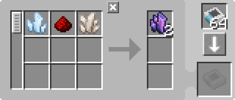
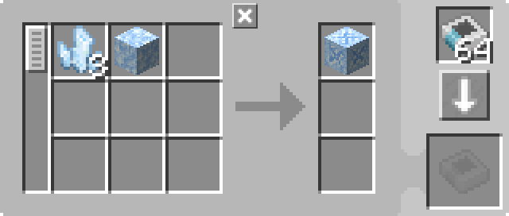

---
navigation:
  parent: example-setups/example-setups-index.md
  title: Автоматизация рецептов с бросанием в воду
  icon: fluix_crystal
---

# Автоматизация рецептов с бросанием в воду

Поскольку используется <ItemLink id="pattern_provider" /> (МЭ поставщик шаблонов), эта схема интегрируется в вашу систему [автоматического изготовления](../ae2-mechanics/autocrafting.md).

Некоторые рецепты требуют бросания предметов в воду (аналогичная схема может использоваться для бросания предметов в другие места). Это можно автоматизировать с помощью <ItemLink id="formation_plane" /> (Плоскости формирования), <ItemLink id="annihilation_plane" /> (Плоскости уничтожения) и вспомогательной инфраструктуры (по сути, это две модифицированные [подсети-трубы](pipe-subnet.md)).

Эта схема предназначена для использования в сочетании с [автоматизацией зарядника](charger-automation.md) для предоставления <ItemLink id="charged_certus_quartz_crystal" /> (Заряженных кристаллов кварца цертуса).

<GameScene zoom="6" interactive={true}>
  <ImportStructure src="../assets/assemblies/throw_in_water.snbt" />

<BoxAnnotation color="#dddddd" min="2 0 1" max="3 1 2">
        (1) Поставщик шаблонов: В стандартной конфигурации, с соответствующими шаблонами обработки.

         
  </BoxAnnotation>

<BoxAnnotation color="#dddddd" min="1.7 0 1" max="2 1 2">
        (2) Интерфейс: В стандартной конфигурации.
  </BoxAnnotation>

<BoxAnnotation color="#dddddd" min="1 .7 1" max="2 1 2">
        (3) Плоскость формирования: Настроена на выбрасывание входных данных как предметы.
  </BoxAnnotation>

<BoxAnnotation color="#dddddd" min="1 2 1" max="2 2.3 2">
        (4) Плоскость уничтожения: Без интерфейса настройки.
  </BoxAnnotation>

<BoxAnnotation color="#dddddd" min="2 1 1" max="3 1.3 2">
        (5) Шина хранения: Отфильтрована на выходы шаблонов.
        <Row><ItemLink id="fluix_crystal" /><ItemLink id="flawless_budding_quartz" /></Row>
  </BoxAnnotation>

<DiamondAnnotation pos="3.9 0.5 1.5" color="#00ff00">
        К основной сети и автоматизации зарядника
        <GameScene zoom="3" background="transparent">
          <ImportStructure src="../assets/assemblies/charger_automation.snbt" />
          <IsometricCamera yaw="195" pitch="30" />
        </GameScene>
    </DiamondAnnotation>

  <IsometricCamera yaw="180" pitch="0" />
</GameScene>

## Настройки и шаблоны

* <ItemLink id="pattern_provider" /> (Поставщик шаблонов) (1): В стандартной конфигурации, с соответствующими <ItemLink id="processing_pattern" /> (Шаблонами обработки).
  * Для <ItemLink id="fluix_crystal" /> (Кристалл флюикса) стандартный рецепт из JEI/REI подходит:

    

  * Для <ItemLink id="flawed_budding_quartz" /> (Неполноценный растущий кварц) лучше использовать прямой рецепт из <ItemLink id="quartz_block" /> (Кварцевый блок), чтобы избежать проблем с пересечением входа одного рецепта с выходом другого, из-за чего шина хранения не сможет фильтровать:

    

* <ItemLink id="interface" /> (Интерфейс) (2): В стандартной конфигурации.
* <ItemLink id="formation_plane" /> (Плоскость формирования) (3): Настроена на выбрасывание входных данных как предметы.
* <ItemLink id="annihilation_plane" /> (Плоскость уничтожения) (4): Без интерфейса настройки.
* <ItemLink id="storage_bus" /> (Шина хранения) (5): Отфильтрована на выходы шаблонов.

## Как это работает

1. <ItemLink id="pattern_provider" /> (Поставщик шаблонов) отправляет ингредиенты в <ItemLink id="interface" /> (Интерфейс) на своей стороне, на зелёной подсети.
2. Интерфейс (по умолчанию не настроен на хранение) пытается отправить содержимое в [сетевое хранилище](../ae2-mechanics/import-export-storage.md).
3. Единственное хранилище на зелёной подсети — <ItemLink id="formation_plane" /> (Плоскость формирования), которая выбрасывает полученные предметы в воду.
4. <ItemLink id="annihilation_plane" /> (Плоскость уничтожения) на оранжевой подсети пытается забрать выброшенные предметы, но не может, так как <ItemLink id="storage_bus" /> (Шина хранения) над поставщиком шаблонов (единственное хранилище на оранжевой подсети) отфильтрована только на результаты возможных крафтов.
5. Предметы проходят преобразование в мире.
6. Теперь плоскость уничтожения может забрать предметы перед собой, так как шина хранения допускает их хранение.
7. Шина хранения сохраняет полученные предметы в поставщике шаблонов, возвращая их в сеть.