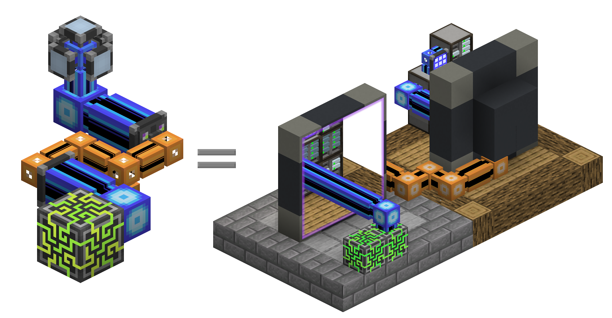
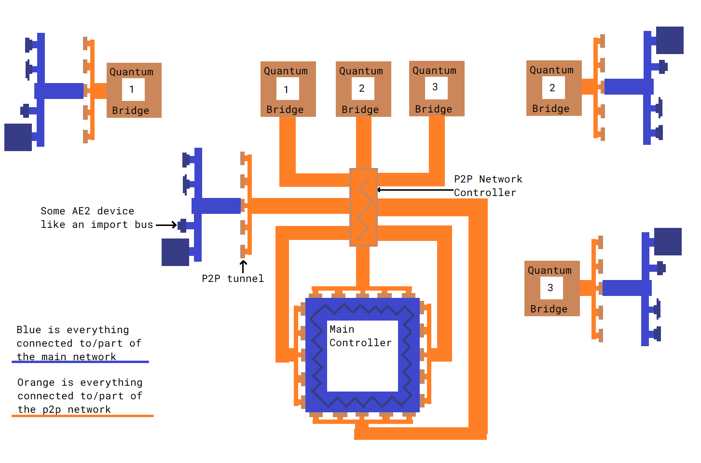

---
navigation:
  parent: items-blocks-machines-index.md
  title: МЭ туннели P2P
  icon: me_p2p_tunnel
  position: 210
categories:
- devices
item_ids:
- ae2:me_p2p_tunnel
- ae2:redstone_p2p_tunnel
- ae2:item_p2p_tunnel
- ae2:fluid_p2p_tunnel
- ae2:fe_p2p_tunnel
- ae2:light_p2p_tunnel
---

# МЭ туннели точка-точка

<GameScene zoom="6" background="transparent">
  <ImportStructure src="../assets/assemblies/p2p_tunnels.snbt" />
  <IsometricCamera yaw="195" pitch="30" />
</GameScene>

МЭ туннели P2P — это способ перемещать такие вещи, как предметы, жидкости, сигналы редстоуна, энергию, свет и [каналы](../ae2-mechanics/channels.md), по сети, без их прямого взаимодействия с сетью. Существует множество вариантов туннелей P2P, но каждый транспортирует только свой специфический тип. Они действуют как порталы, напрямую соединяющие две стороны блока на расстоянии. Они не являются двунаправленными, у них есть определённые входы и выходы.

Например, воронка, обращённая к МЭ туннелю P2P для предметов, будет действовать так, как будто она напрямую подключена к бочке, и предметы будут перетекать.

<GameScene zoom="4" background="transparent">
  <ImportStructure src="../assets/assemblies/p2p_hopper_barrel.snbt" />
  <IsometricCamera yaw="195" pitch="30" />
</GameScene>

Однако две бочки рядом друг с другом не будут передавать предметы между собой.

<GameScene zoom="4" background="transparent">
  <ImportStructure src="../assets/assemblies/p2p_barrel_barrel.snbt" />
  <IsometricCamera yaw="195" pitch="30" />
</GameScene>

Также существуют другие варианты, такие как МЭ туннель P2P для редстоуна.

<GameScene zoom="4" background="transparent">
  <ImportStructure src="../assets/assemblies/p2p_redstone.snbt" />
  <IsometricCamera yaw="195" pitch="30" />
</GameScene>

## Типы туннелей P2P и настройка

<GameScene zoom="6" background="transparent">
  <ImportStructure src="../assets/assemblies/p2p_tunnels.snbt" />
  <IsometricCamera yaw="180" pitch="90" />
</GameScene>

Существует множество типов туннелей P2P. Только МЭ туннель P2P для МЭ можно создать напрямую, остальные создаются путём ПКМ по другим туннелям P2P определёнными предметами:

* МЭ туннели P2P для МЭ выбираются ПКМ с любым [кабелем](../items-blocks-machines/cables.md).
* МЭ туннели P2P для редстоуна выбираются ПКМ с различными компонентами редстоуна.
* МЭ туннели P2P для предметов выбираются ПКМ с сундуком или воронкой.
* МЭ туннели P2P для жидкостей выбираются ПКМ с ведром или бутылкой.
* МЭ туннели P2P для энергии выбираются ПКМ с почти любым предметом, содержащим энергию.
* МЭ туннели P2P для света выбираются ПКМ с факелом или светокамнем.

Некоторые типы туннелей имеют особенности. Например, каналы МЭ туннелей P2P для МЭ не могут проходить через другие МЭ туннели P2P, а МЭ туннели P2P для энергии косвенно взимают 5% налог на FE или E, проходящие через них, увеличивая их потребление [энергии](../ae2-mechanics/energy.md).

## Наиболее распространённое использование туннелей P2P

Наиболее частый случай использования туннелей P2P — это использование МЭ туннеля P2P для МЭ для уплотнения передачи [каналов](../ae2-mechanics/channels.md). Вместо пучка плотных кабелей можно использовать один плотный кабель для передачи множества каналов.

В этом примере 8 входов МЭ туннелей P2P принимают 256 каналов (8*32) от основного сетевого <ItemLink id="controller" />, а 8 выходов МЭ туннелей P2P выводят их в другое место. Обратите внимание, что каждый вход или выход туннеля P2P занимает 1 канал. Таким образом, мы можем передавать множество каналов через тонкий кабель. А поскольку наши туннели P2P находятся в выделенной [подсети](../ae2-mechanics/subnetworks.md), мы даже не используем каналы основной сети для этого! Также обратите внимание, что, хотя туннели P2P можно размещать непосредственно у контроллера, между ними можно поместить [плотный умный кабель](../items-blocks-machines/cables.md#smart-cable) для более удобной визуализации каналов.

<GameScene zoom="4" interactive={true}>
  <ImportStructure src="../assets/assemblies/p2p_compact_channels.snbt" />
  <BoxAnnotation color="#dddddd" min="1.3 1.3 6.3" max="2 2.7 6.7">
        Кварцевое волокно разделяет энергию между основной сетью и подсетью P2P.
  </BoxAnnotation>
  <IsometricCamera yaw="225" pitch="30" />
</GameScene>

Для другого примера (включая использование с [МЭ квантовыми мостами](quantum_bridge.md)) смотрите эту схему, нарисованную в MS Paint, которую я не стал дорабатывать:

## Вложение

Однако вы не можете использовать это для передачи бесконечного количества каналов через один кабель. Канал МЭ туннеля P2P для МЭ не проходит через другой МЭ туннель P2P, поэтому их нельзя рекурсивно вкладывать. Обратите внимание, как внешний слой МЭ туннелей P2P на красных кабелях отключён. Это относится только к МЭ туннелям P2P для МЭ; другие типы туннелей P2P могут проходить через МЭ туннель P2P, как видно по работающим туннелям P2P для редстоуна.

<GameScene zoom="4" background="transparent">
  <ImportStructure src="../assets/assemblies/p2p_nesting.snbt" />
  <IsometricCamera yaw="225" pitch="30" />
</GameScene>

## Связывание

<GameScene zoom="6" background="transparent">
  <ImportStructure src="../assets/assemblies/p2p_linking_frequency.snbt" />
  <IsometricCamera yaw="195" pitch="30" />
</GameScene>

Концы соединения туннеля P2P можно связать с помощью <ItemLink id="memory_card" />. Частота будет отображаться в виде массива 2x2 цветов на задней стороне туннеля.

* Shift+ПКМ для создания новой частоты связи P2P.
* ПКМ для вставки настроек, карт улучшений или частоты связи.

Туннель, по которому вы щёлкнули Shift+ПКМ, будет входом, а туннель, по которому вы щёлкнули ПКМ, — выходом. Вы можете иметь несколько выходов, но для МЭ туннелей P2P для МЭ каналы, поступающие на вход, будут разделяться между выходами, так что вы не можете дублировать каналы.

## Рецепт

<RecipeFor id="me_p2p_tunnel" />