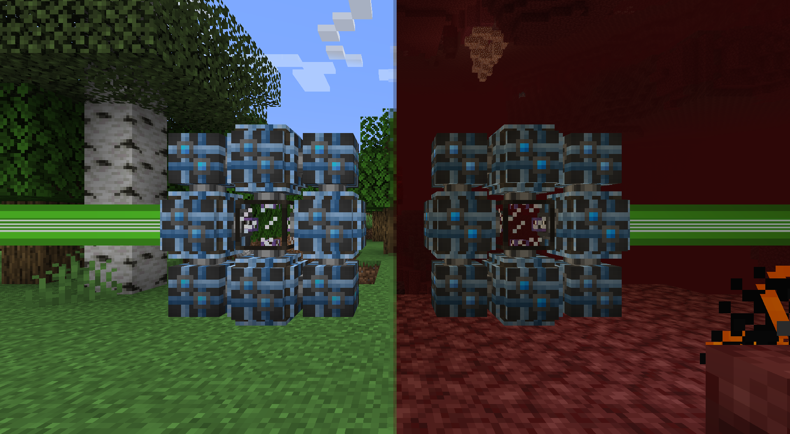

---
navigation:
  parent: items-blocks-machines-index.md
  title: МЭ квантовый мост
  icon: quantum_ring
  position: 110
categories:
- network infrastructure
item_ids:
- ae2:quantum_link
- ae2:quantum_ring
---

# МЭ квантовый сетевой мост

МЭ квантовые сетевые мосты могут расширять [сеть](../ae2-mechanics/me-network-connections.md) на бесконечные расстояния и даже между измерениями. Они могут передавать в общей сложности 32 канала (независимо от того, как кабели подключены к каждой стороне), по сути, действуя как беспроводной [плотный кабель](cables.md#dense-cable).

<GameScene zoom="4" background="transparent">
  <ImportStructure src="../assets/assemblies/quantum_bridge_internal_structure_1.snbt" />
  <IsometricCamera yaw="195" pitch="30" />
</GameScene>

<GameScene zoom="4" background="transparent">
  <ImportStructure src="../assets/assemblies/quantum_bridge_internal_structure_2.snbt" />
  <BoxAnnotation color="#33dd33" min="1 1 1" max="6 2 3">
        Воображаемый кабель между двумя конечными точками
  </BoxAnnotation>
  <IsometricCamera yaw="195" pitch="30" />
</GameScene>

Важно отметить, что **обе стороны должны быть загружены в чанке**, поэтому необходимо использовать <ItemLink id="spatial_anchor" /> или другой загрузчик чанков, если две стороны находятся далеко друг от друга.

# МЭ квантовое кольцо

<BlockImage id="quantum_ring" scale="8" />

Восемь таких блоков, размещённых вокруг <ItemLink id="quantum_link" />, создают МЭ квантовый сетевой мост. Только 4 блока <ItemLink id="quantum_ring" />, прилегающих к <ItemLink id="quantum_link" />, могут принимать сетевые подключения, 4 угловых блока не могут подключаться к кабелям.

## Рецепт

<RecipeFor id="quantum_ring" />

# МЭ квантовая камера связи

<BlockImage id="quantum_link" scale="8" />

Один такой блок, окружённый <ItemLink id="quantum_ring" />, создаёт МЭ квантовый сетевой мост. Этот блок не подключается к кабелям и регистрируется как часть сети только после создания полного моста.

Инвентарь этого блока может содержать только одну <ItemLink id="quantum_entangled_singularity" /> и доступен для автоматизации.

## Рецепт

<RecipeFor id="quantum_link" />